# Cairo Tutorial

This tutorial is derived from Cairo C tutorial [https://www.cairographics.org/tutorial/] based on Michael Urman's [cairo tutorial for python programmers](http://www.tortall.net/mu/wiki/CairoTutorial). The original code snippets have been translated to Eiffel, the text has only been changed as much as necessary.

Cairo is a powerful 2d graphics library. This document introduces you to how cairo works and many of the functions you will use to create the graphic experience you desire.

In order to follow along on your computer, you need the following things:

1. Cairo itself. You will need both the library and the development files. See [Download](https://www.cairographics.org/download/) if you don't have it already.
2. An Eiffel compiler.[https://www.eiffel.org/] 
3. The [FAQ](https://www.cairographics.org/FAQ/) contains a minimal example on how to turn
the code into a program that produces the desired output.

If you want to see the code snippets included in this tutorial in action, you can try to click on some of the images. You will get a
small Eiffel program which includes the described drawing code.

> Note: The text mentions `cairo_push_group()` and
  `cairo_pop_group()`. At least cairo version 1.2.0 is needed for
  this.

## Table of Contents

* [Cairo's Drawing Model](#l1draw)

  - [Nouns](#l2nouns)
  - [Verbs](#l2verbs)
* [Drawing with Cairo](#l1drawing)

  - [Preparing and Selecting a Source](#l2preparesource)
  - [Creating a Path](#l2createpath)
* [Understanding Text](#l1understandingtext)
* [Working with Transforms](#l1transforms)
* [Where to Go Next](#l1gonext)
* [Tips and Tricks](#l1tips)

  - [Line Width](#l2linewidth)
  - [Text Alignment](#l2textalign)

# Cairo's Drawing Model

In order to explain the operations used by cairo, we first delve into a model of how cairo models drawing. There are only a few concepts involved, which are then applied over and over by the different methods. First I'll describe the [nouns](#l2nouns): [destination](#l3destination), [source](#l3source), [mask](#l3mask), [path](#l3path), and [context](#l3context). After that I'll describe the [verbs](#l2verbs) which offer ways to manipulate the nouns and draw the graphics you wish to create.

## Nouns

Cairo's nouns are somewhat abstract. To make them concrete I'm including diagrams that depict how they interact. The first three nouns are the threelayers in the diagrams you see in this section. The fourth noun, the path, is drawn on the middle layer when it is relevant. The final noun, the context, isn't shown.

### Destination

The destination is the [surface](http://www.cairographics.org/manual/cairo-surfaces.html) on which you're drawing. It may be tied to an array of pixels like in this tutorial, or it might be tied to a SVG or PDF file, or something else. This surface collects the elements of your graphic as you apply them, allowing you to build up a complex work as though painting on a canvas. 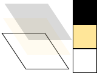

### Source

The source is the "paint" you're about to work with. I show this as it is—plain black for several examples—but translucent to show lower layers. Unlike real paint, it doesn't have to be a single color; it can be a [pattern](http://www.cairographics.org/manual/cairo-cairo-pattern-t.html) or even a previously created destination [surface](http://www.cairographics.org/manual/cairo-surfaces.html) (see [How do I paint from one surface to another?](http://cairographics.org/FAQ/#paint_from_a_surface)). Also unlike real paint it can contain transparency information—the Alpha channel.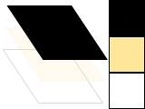

### Mask

The mask is the most important piece: it controls where you apply the source to the destination. I will show it as a yellow layer with holes where it lets the source through. When you apply a drawing verb, it's like you stamp the source to the destination. Anywhere the mask allows, the source is copied. Anywhere the mask disallows, nothing happens.
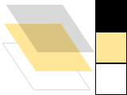
### Path

The path is somewhere between part of the mask and part of the context. I will show it as thin green lines on the mask layer. It is manipulated by path verbs, then used by drawing verbs.

### Context

The context keeps track of everything that verbs affect. It tracks one source, one destination, and one mask. It also tracks several helper variables like your line width and style, your font face and size, and more. Most importantly it tracks the path, which is turned into a mask by drawing verbs.

Before you can start to draw something with cairo, you need to create the context. The context is stored in cairo's central data type, called `cairo_t`. When you create a cairo context, it must be tied to a specific surface—for example, an image surface if you want to create a PNG file.  There is also a data type for the surface, called `cairo_surface_t` (in Eiffel `CAIRO_SURFACE_STRUCT_API`). You can initialize your cairo context like this:

```
surface: CAIRO_SURFACE_STRUCT_API
cr: CAIRO_STRUCT_API

surface := {CAIRO_FUNCTIONS}.cairo_image_surface_create ({CAIRO_FORMAT_ENUM_API}.CAIRO_FORMAT_ARGB32, 120, 120)
cr := {CAIRO_FUNCTIONS}.cairo_create (surface)
```

The cairo context in this example is tied to an image surface of dimension 120 x 120 and 32 bits per pixel to store RGB and Alpha
information. Surfaces can be created specific to most cairo backends, see the [manual](http://cairographics.org/manual/cairo-surfaces.html) for details.

## Verbs

The reason you are using cairo in a program is to draw. Cairo internally draws with one fundamental drawing operation: the source and mask are freely placed somewhere over the destination. Then the layers are all pressed together and the paint from the source is transferred to the destination wherever the mask allows it. To that extent the following five drawing verbs, or operations, are all similar. They differ by how they construct the mask.

### Stroke

The [`cairo_stroke()`](http://www.cairographics.org/manual/cairo-cairo-t.html#cairo-stroke) operation takes a virtual pen along the path.It allows the source to transfer through the mask in a thin (or thick) line around the path, according to the pen's [line width](http://www.cairographics.org/manual/cairo-cairo-t.html#cairo-set-line-width), [dash style](http://www.cairographics.org/manual/cairo-cairo-t.html#cairo-set-dash), and [line caps](http://www.cairographics.org/manual/cairo-cairo-t.html#cairo-set-line-cap).

Note: To see the code snippet in action, use the stroke.c file linked from the figure to the right. Just pasting the snippet into the FAQ's hello.c might give unexpected results due to different scaling. Read on; scaling is explained in section [Working with Transforms](#l1transforms) below.

```
{CAIRO_FUNCTIONS}.cairo_set_line_width (cr, 0.1)
{CAIRO_FUNCTIONS}.cairo_set_source_rgb (cr, 0, 0, 0)
{CAIRO_FUNCTIONS}.cairo_rectangle (cr, 0.25, 0.25, 0.5, 0.5)
{CAIRO_FUNCTIONS}.cairo_stroke (cr)
```
[![stroke]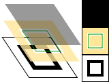](./stroke)

### Fill

The [`cairo_fill()`](http://www.cairographics.org/manual/cairo-cairo-t.html#cairo-fill) operation instead uses the path like the lines of a coloring book, and allows the source through the mask within the hole whose boundaries are the path. For complex paths (paths with multiple closed sub-paths—like a donut—or paths that self-intersect) this is influenced by the [fill rule](http://www.cairographics.org/manual/cairo-cairo-t.html#cairo-set-fill-rule). Note that while stroking the path transfers the source for half of the line width on each side of the path, filling a path fills directly up to the edge of the path and no further.

```
{CAIRO_FUNCTIONS}.cairo_set_source_rgb (cr, 0, 0, 0)
{CAIRO_FUNCTIONS}.cairo_rectangle (cr, 0.25, 0.25, 0.5, 0.5)
{CAIRO_FUNCTIONS}.cairo_fill (cr)
```
[![fill]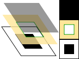](./fill)

### Show Text / Glyphs

The [`cairo_show_text()`](http://www.cairographics.org/manual/cairo-text.html#cairo-show-text) operation forms the mask from text. It may be easier to think of `cairo_show_text()` as a shortcut for creating a path with [`cairo_text_path()`](http://www.cairographics.org/manual/cairo-Paths.html#cairo-text-path) and then using [`cairo_fill()`](http://www.cairographics.org/manual/cairo-cairo-t.html#cairo-fill) to transfer it. Be aware `cairo_show_text()` caches glyphs so is much more efficient if you work with a lot of text.

```
te: CAIRO_TEXT_EXTENTS_T_STRUCT_API
	
{CAIRO_FUNCTIONS}.cairo_set_source_rgb (cr, 0, 0, 0)
{CAIRO_FUNCTIONS}.cairo_select_font_face (cr, "Georgia", {CAIRO_FONT_SLANT_ENUM_API}.CAIRO_FONT_SLANT_NORMAL, {CAIRO_FONT_WEIGHT_ENUM_API}.CAIRO_FONT_WEIGHT_BOLD)
{CAIRO_FUNCTIONS}.cairo_set_font_size (cr, 1.2)
create te.make
{CAIRO_FUNCTIONS}.cairo_text_extents (cr, "a", te)
{CAIRO_FUNCTIONS}.cairo_move_to (cr, 0.5 - te.width / 2 - te.x_bearing,	0.5 - te.height / 2 - te.y_bearing);
{CAIRO_FUNCTIONS}.cairo_show_text (cr, "a");
```
[![show_text]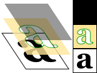](./show_text)

### Paint

The [`cairo_paint()`](http://www.cairographics.org/manual/cairo-cairo-t.html#cairo-paint) operation uses a mask that transfers the entire source to the destination. Some people consider this an infinitely large mask, and others consider it no mask; the result is the same. The related operation [`cairo_paint_with_alpha()`](http://www.cairographics.org/manual/cairo-cairo-t.html#cairo-paint-with-alpha) similarly allows transfer of the full source to destination, but it transfers only the provided percentage of the color.

```
{CAIRO_FUNCTIONS}.cairo_set_source_rgb (cr, 0.0, 0.0, 0.0)
{CAIRO_FUNCTIONS}.cairo_paint_with_alpha (cr, 0.5)
```
[![paint]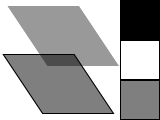](./paint)

### Mask

The  [`cairo_mask()`](http://www.cairographics.org/manual/cairo-cairo-t.html#cairo-mask)  and [`cairo_mask_surface()`](http://www.cairographics.org/manual/cairo-cairo-t.html#cairo-mask-surface) operations allow transfer according to the transparency/opacity of a second source pattern or surface. Where the pattern or surface is opaque, the current source is transferred to the destination.  Where the pattern or surface is transparent, nothing is transferred.

```
linpat, radpat: CAIRO_PATTERN_STRUCT_API

linpat := {CAIRO_FUNCTIONS}.cairo_pattern_create_linear (0, 0, 1, 1)
{CAIRO_FUNCTIONS}.cairo_pattern_add_color_stop_rgb (linpat, 0, 0, 0.3, 0.8)
{CAIRO_FUNCTIONS}.cairo_pattern_add_color_stop_rgb (linpat, 1, 0, 0.8, 0.3)

radpat := {CAIRO_FUNCTIONS}.cairo_pattern_create_radial (0.5, 0.5, 0.25, 0.5, 0.5, 0.75);
{CAIRO_FUNCTIONS}.cairo_pattern_add_color_stop_rgba (radpat, 0, 0, 0, 0, 1)
{CAIRO_FUNCTIONS}.cairo_pattern_add_color_stop_rgba (radpat, 0.5, 0, 0, 0, 0)

{CAIRO_FUNCTIONS}.cairo_set_source (cr, linpat)
{CAIRO_FUNCTIONS}.cairo_mask (cr, radpat)
```
[![mask]](./mask)

# Drawing with Cairo

In order to create an image you desire, you have to prepare the [context](http://www.cairographics.org/manual/cairo-cairo-t.html) for each of the drawing verbs. To use [`cairo_stroke()`](http://www.cairographics.org/manual/cairo-cairo-t.html#cairo-stroke) or [`cairo_fill()`](http://www.cairographics.org/manual/cairo-cairo-t.html#cairo-fill) you first need a path. To use [`cairo_show_text()`](http://www.cairographics.org/manual/cairo-text.html#cairo-show-text) you must position your text by its insertion point. To use [`cairo_mask()`](http://www.cairographics.org/manual/cairo-cairo-t.html#cairo-mask) you need a second source [pattern](http://www.cairographics.org/manual/cairo-cairo-pattern-t.html) or [surface](http://www.cairographics.org/manual/cairo-cairo-surface-t.html). And to use any of the operations, including [`cairo_paint()`](http://www.cairographics.org/manual/cairo-cairo-t.html#cairo-paint), you need a primary source.

## Preparing and Selecting a Source

There are three main kinds of sources in cairo: colors, gradients, and images. Colors are the simplest; they use a uniform hue and opacity for
the entire source. You can select these without any preparation with [`cairo_set_source_rgb()`](http://www.cairographics.org/manual/cairo-cairo-t.html#cairo-set-source-rgb) and [`cairo_set_source_rgba()`](http://www.cairographics.org/manual/cairo-cairo-t.html#cairo-set-source-rgba). 
Using `cairo_set_source_rgb (cr, r, g, b)` is equivalent to using `cairo_set_source_rgba (cr, r, g, b, 1.0)`, and it sets your source
color to use full opacity.

```
{CAIRO_FUNCTIONS}.cairo_set_source_rgb (cr, 0, 0, 0)
{CAIRO_FUNCTIONS}.cairo_move_to (cr, 0, 0)
{CAIRO_FUNCTIONS}.cairo_line_to (cr, 1, 1)
{CAIRO_FUNCTIONS}.cairo_move_to (cr, 1, 0)
{CAIRO_FUNCTIONS}.cairo_line_to (cr, 0, 1)
{CAIRO_FUNCTIONS}.cairo_set_line_width (cr, 0.2)
{CAIRO_FUNCTIONS}.cairo_stroke (cr)

{CAIRO_FUNCTIONS}.cairo_rectangle (cr, 0, 0, 0.5, 0.5)
{CAIRO_FUNCTIONS}.cairo_set_source_rgba (cr, 1, 0, 0, 0.80)
{CAIRO_FUNCTIONS}.cairo_fill (cr)

{CAIRO_FUNCTIONS}.cairo_rectangle (cr, 0, 0.5, 0.5, 0.5)
{CAIRO_FUNCTIONS}.cairo_set_source_rgba (cr, 0, 1, 0, 0.60)
{CAIRO_FUNCTIONS}.cairo_fill (cr);

{CAIRO_FUNCTIONS}.cairo_rectangle (cr, 0.5, 0, 0.5, 0.5)
{CAIRO_FUNCTIONS}.cairo_set_source_rgba (cr, 0, 0, 1, 0.40)
{CAIRO_FUNCTIONS}.cairo_fill (cr);
```
[![set_source_rgba]](./set_source_rgba)

Gradients describe a progression of colors by setting a start and stop reference location and a series of "stops" along the way. [Linear gradients](http://www.cairographics.org/manual/cairo-cairo-pattern-t.html#cairo-pattern-create-linear) are built from two points which pass through parallel lines to define the start and stop locations. [Radial gradients](http://www.cairographics.org/manual/cairo-cairo-pattern-t.html#cairo-pattern-create-radial) are also built from two points, but each has an associated radius of the circle on which to define the start and stop locations. Stops are added to the gradient with [`cairo_add_color_stop_rgb()`](http://www.cairographics.org/manual/cairo-cairo-pattern-t.html#cairo-pattern-add-color-stop-rgb) and [`cairo_add_color_stop_rgba()`](http://www.cairographics.org/manual/cairo-cairo-pattern-t.html#cairo-pattern-add-color-stop-rgba) which take a color like `cairo_set_source_rgb*()`, as well as an offset to indicate where it lies between the reference locations. The colors between adjacent stops are averaged over space to form a smooth blend. Finally, the behavior beyond the reference locations can be controlled
with [`cairo_set_extend()`](http://www.cairographics.org/manual/cairo-cairo-pattern-t.html#cairo-pattern-set-extend).

```
radpat, linpat: CAIRO_PATTERN_STRUCT_API

radpat := {CAIRO_FUNCTIONS}.cairo_pattern_create_radial (0.25, 0.25, 0.1, 0.5, 0.5, 0.5)
{CAIRO_FUNCTIONS}.cairo_pattern_add_color_stop_rgb (radpat, 0, 1.0, 0.8, 0.8)
{CAIRO_FUNCTIONS}.cairo_pattern_add_color_stop_rgb (radpat, 1, 0.9, 0.0, 0.0)

across 1 |..| 9 as ic loop
	across 1 |..| 9 as jc loop
		{CAIRO_FUNCTIONS}.cairo_rectangle (cr, ic.item / 10.0 - 0.04, jc.item / 10.0 - 0.04, 0.08, 0.08)
	end
end
{CAIRO_FUNCTIONS}.cairo_set_source (cr, radpat)
{CAIRO_FUNCTIONS}.cairo_fill (cr)

linpat := {CAIRO_FUNCTIONS}.cairo_pattern_create_linear (0.25, 0.35, 0.75, 0.65)
{CAIRO_FUNCTIONS}.cairo_pattern_add_color_stop_rgba (linpat, 0.00, 1, 1, 1, 0)
{CAIRO_FUNCTIONS}.cairo_pattern_add_color_stop_rgba (linpat, 0.25, 0, 1, 0, 0.5)
{CAIRO_FUNCTIONS}.cairo_pattern_add_color_stop_rgba (linpat, 0.50, 1, 1, 1, 0)
{CAIRO_FUNCTIONS}.cairo_pattern_add_color_stop_rgba (linpat, 0.75, 0, 0, 1, 0.5)
{CAIRO_FUNCTIONS}.cairo_pattern_add_color_stop_rgba (linpat, 1.00, 1, 1, 1, 0)

{CAIRO_FUNCTIONS}.cairo_rectangle (cr, 0.0, 0.0, 1, 1)
{CAIRO_FUNCTIONS}.cairo_set_source (cr, linpat)
{CAIRO_FUNCTIONS}.cairo_fill (cr)
```
[![set_source_gradient]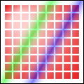](./set_source_gradient)

Images include both surfaces loaded from existing files with [`cairo_image_surface_create_from_png()`](http://www.cairographics.org/manual/cairo-PNG-Support.html#cairo-image-surface-create-from-png) and surfaces created from within cairo as an earlier destination. As of cairo 1.2, the easiest way to make and use an earlier destination as a source is with [`cairo_push_group()`](http://www.cairographics.org/manual/cairo-cairo-t.html#cairo-push-group) and either [`cairo_pop_group()`](http://www.cairographics.org/manual/cairo-cairo-t.html#cairo-pop-group) or [`cairo_pop_group_to_source()`](http://www.cairographics.org/manual/cairo-cairo-t.html#cairo-pop-group-to-source). Use `cairo_pop_group_to_source()` to use it just until you select a new source, and `cairo_pop_group()` when you want to save it so you select it over and over again with [`cairo_set_source()`](http://www.cairographics.org/manual/cairo-cairo-t.html#cairo-set-source).

## Creating a Path

Cairo always has an active path. If you call [`cairo_stroke()`](#l3stroke) it will draw the path with your line settings. If you call [`cairo_fill()`](#l3fill) it will fill the inside of the path. But as often as not, the path is empty, and both calls will result in no change to your destination. Why is it empty so often? For one, it starts that way; but more importantly after each [`cairo_stroke()`](#l3stroke) or [`cairo_fill()`](#l3fill) it is emptied again to let you start building your next path.

What if you want to do multiple things with the same path? For instance to draw a red rectangle with a black border, you would want to fill the rectangle path with a red source, then stroke the same path with a black source. A rectangle path is easy to create multiple times, but a lot of paths are more complex.

Cairo supports easily reusing paths by having alternate versions of its operations. Both draw the same thing, but the alternate doesn't reset
the path.  For stroking, alongside [`cairo_stroke()`](http://www.cairographics.org/manual/cairo-cairo-t.html#cairo-stroke) there is [`cairo_stroke_preserve()`](http://www.cairographics.org/manual/cairo-cairo-t.html#cairo-stroke-preserve); for filling, [`cairo_fill_preserve()`](http://www.cairographics.org/manual/cairo-cairo-t.html#cairo-fill-preserve) joins [`cairo_fill()`](http://www.cairographics.org/manual/cairo-cairo-t.html#cairo-fill). Even setting the clip has a preserve variant.  Apart from choosing when to preserve your path, there are only a couple common operations.

### Moving

Cairo uses a connect-the-dots style system when creating paths.  Start at 1, draw a line to 2, then 3, and so forth. When you start a path, or when you need to start a new sub-path, you want it to be like point 1: it has nothing connecting to it. For this, use [`cairo_move_to()`](http://www.cairographics.org/manual/cairo-Paths.html#cairo-move-to). This sets the current reference point without making the path connect the previous point to it. There is also a relative coordinate variant, [`cairo_rel_move_to()`](http://www.cairographics.org/manual/cairo-Paths.html#cairo-rel-move-to), which sets the new reference a specified distance away from the current reference instead. After setting your first reference point, use the other path operations which both update the reference point and connect to it in some way.

```
{CAIRO_FUNCTIONS}.cairo_move_to (cr, 0.25, 0.25)
```
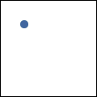

### Straight Lines

Whether with absolute coordinates [`cairo_line_to()`](http://www.cairographics.org/manual/cairo-Paths.html#cairo-line-to) (extend the path from the reference to this point), or relative coordinates [`cairo_rel_line_to()`](http://www.cairographics.org/manual/cairo-Paths.html#cairo-rel-line-to) (extend the path from the reference this far in this direction), the path connection will be a straight line. The new reference point will be at the other end of the line.

```
{CAIRO_FUNCTIONS}.cairo_line_to (cr, 0.5, 0.375)
{CAIRO_FUNCTIONS}.cairo_rel_line_to (cr, 0.25, -0.125)
```
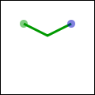

### Arcs

Arcs are parts of the outside of a circle. Unlike straight lines, the point you directly specify is not on the path. Instead it is the center of the circle that makes up the addition to the path. Both a starting and ending point on the circle must be specified, and these points are connected either clockwise by [`cairo_arc()`](http://www.cairographics.org/manual/cairo-Paths.html#cairo-arc) or counter-clockwise by [`cairo_arc_negative()`](http://www.cairographics.org/manual/cairo-Paths.html#cairo-arc-negative). If the previous reference point is not on this new curve, a straight line is added from it to where the arc begins. The reference point is then updated to where the arc ends. There are only absolute versions.

```
{CAIRO_FUNCTIONS}.cairo_arc (cr, 0.5, 0.5, 0.25 * {SINGLE_MATH}.sqrt (2), -0.25 * {MATH_CONST}.PI, 0.25 * {MATH_CONST}.PI)
```


### Curves

Curves in cairo are cubic Bézier splines. They start at the current reference point and smoothly follow the direction of two other points (without going through them) to get to a third specified point. Like lines, there are both absolute ([`cairo_curve_to()`](http://www.cairographics.org/manual/cairo-Paths.html#cairo-curve-to)) and relative ([`cairo_rel_curve_to()`](http://www.cairographics.org/manual/cairo-Paths.html#cairo-rel-curve-to)) versions. Note that the relative variant specifies all points relative to the previous reference point, rather than each relative to the preceding control point of the curve.

```
{CAIRO_FUNCTIONS}.cairo_rel_curve_to (cr, -0.25, -0.125, -0.25, 0.125, -0.5, 0)
```
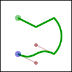

### Close the path

Cairo can also close the path by drawing a straight line to the beginning of the current sub-path. This straight line can be useful for the last edge of a polygon, but is not directly useful for curve-based shapes. A closed path is fundamentally different from an open path: it's
one continuous path and has no start or end. A closed path has no line caps for there is no place to put them.

```
{CAIRO_FUNCTIONS}.cairo_close_path (cr)
```
[![path_close]](./path_close)

### Text

Finally text can be turned into a path with [`cairo_text_path()`](http://www.cairographics.org/manual/cairo-Paths.html#cairo-text-path). Paths created from text are like any other path, supporting stroke or fill operations. This path is placed anchored to the current reference point, so [`cairo_move_to()`](#l3moving) your desired location before turning text into a path. However there are performance concerns to doing this if you are working with a lot of text; when possible you should prefer using the verb [`cairo_show_text()`](#l3showtext) over [`cairo_text_path()`](#l3text) and [`cairo_fill()`](#l3fill).

# Understanding Text

To use text effectively you need to know where it will go. The methods [`cairo_font_extents()`](http://www.cairographics.org/manual/cairo-text.html#cairo-font-extents) and [`cairo_text_extents()`](http://www.cairographics.org/manual/cairo-text.html#cairo-text-extents) get you this information. Since this diagram is hard to see so small, Isuggest getting its [source](https://www.cairographics.org/tutorial/textextents.c) and bump the size up to 600. It shows the relation between the reference point (red dot); suggested next reference point (blue dot); bounding box (dashed blue lines); bearing displacement (solid blue line); and height, ascent, baseline, and descent lines (dashed green).
[![text_extents]](./text_extents)
The reference point is always on the baseline. The descent line is below that,and reflects a rough bounding box for all characters in the font. However it isan artistic choice intended to indicate alignment rather than a true bounding box. The same is true for the ascent line above. Next above that is the height line, the artist-recommended spacing between subsequent baselines. All three of these are reported as distances from the baseline, and expected to be positive despite their differing directions.

The bearing is the displacement from the reference point to the upper-left corner of the bounding box. It is often zero or a small positive value for x displacement, but can be negative x for characters like j as shown; it's almost always a negative value for y displacement. The width and height then describe the size of the bounding box. The advance takes you to the suggested reference point for the next letter. Note that bounding boxes for subsequent blocks of text can overlap if the bearing is negative, or the advance is smaller than the width would suggest.

In addition to placement, you also need to specify a face, style, and size. Set the face and style together with [`cairo_select_font_face()`](http://www.cairographics.org/manual/cairo-text.html#cairo-select-font-face), and the size with
[`cairo_set_font_size()`](http://www.cairographics.org/manual/cairo-text.html#cairo-set-font-size). If you need even finer control, try getting a [`cairo_font_options_t`](http://www.cairographics.org/manual/cairo-cairo-font-options-t.html#cairo-font-options-t) with [`cairo_get_font_options()`](http://www.cairographics.org/manual/cairo-text.html#cairo-get-font-options), tweaking it, and setting it with [`cairo_set_font_options()`](http://www.cairographics.org/manual/cairo-text.html#cairo-set-font-options).

# Working with Transforms

Transforms have three major uses. First they allow you to set up a coordinate system that's easy to think in and work in, yet have the output be of any size. Second they allow you to make helper functions that work at or around a (0, 0) but can be applied anywhere in the output image. Thirdly they let you deform the image, turning a circular arc into an elliptical arc, etc. Transforms are a way of setting up a relation between two coordinate systems. The device-space coordinate Nsystem is tied to the surface, and cannot change. The user-space coordinate system matches that space by default, but can be changed for the above reasons. The helper functions [`cairo_user_to_device()`](http://www.cairographics.org/manual/cairo-Transformations.html#cairo-user-to-device) and [`cairo_user_to_device_distance()`](http://www.cairographics.org/manual/cairo-Transformations.html#cairo-user-to-device-distance) tell you what the device-coordinates are for a user-coordinates position or distance.  Correspondingly [`cairo_device_to_user()`](http://www.cairographics.org/manual/cairo-Transformations.html#cairo-device-to-user) and [`cairo_device_to_user_distance()`](http://www.cairographics.org/manual/cairo-Transformations.html#cairo-device-to-user-distance) tell you user-coordinates for a device-coordinates position or distance. Remember to send positions through the non-distance variant, and relative moves or other distances through the distance variant.

I leverage all of these reasons to draw the diagrams in this document. Whether I'm drawing 120 x 120 or 600 x 600, I use [`cairo_scale()`](http://www.cairographics.org/manual/cairo-Transformations.html#cairo-scale) to give me a 1.0 x 1.0 workspace. To place the results along the right column, such as in the discussion of [cairo's drawing model](#l1drawingmodel), I use [`cairo_translate()`](http://www.cairographics.org/manual/cairo-Transformations.html#cairo-translate). And to add the perspective view for the overlapping layers, I set up an arbitrary deformation with [`cairo_transform()`](http://www.cairographics.org/manual/cairo-Transformations.html#cairo-transform) on a [`cairo_matrix_t`](http://www.cairographics.org/manual/cairo-cairo-matrix-t.html#cairo-matrix-t).

To understand your transforms, read them bottom to top, applying them to the point you're drawing. To figure out which transforms to create, think through this process in reverse. For example if I want my 1.0 x 1.0 workspace to be 100 x 100 pixels in the middle of a 120 x 120 pixel surface, I can set it up one of three ways:

1. `cairo_translate (cr, 10, 10); cairo_scale (cr, 100, 100);`
2. `cairo_scale (cr, 100, 100); cairo_translate (cr, 0.1, 0.1);`
3. `cairo_matrix_t mat; cairo_matrix_init ($mat, 100, 0, 0, 100, 10, 10); cairo_transform (cr, $mat);`

Use the first when relevant because it is often the most readable; use the third when necessary to access additional control not available with the primary functions.

Be careful when trying to draw lines while under transform. Even if you set your line width while the scale factor was 1, the line width setting is always in user-coordinates and isn't modified by setting the scale. While you're operating under a scale, the width of your line is multiplied by that scale. To specify a width of a line in pixels, use [`cairo_device_to_user_distance()`](http://www.cairographics.org/manual/cairo-Transformations.html#cairo-device-to-user-distance) to turn a `(1, 1)` device-space distance into, for example, a `(0.01, 0.01)` user-space distance. Note that if your transform deforms the image there isn't necessarily a way to specify a line with a uniform width.

# Where to Go Next

This wraps up the tutorial. It doesn't cover all functions in cairo, so for some "advanced" lesser-used features, you'll need to look elsewhere. The code behind the examples ([layer diagrams](../diagram), [drawing illustrations](https://www.cairographics.org/tutorial/draw.c)) uses a handful of techniques that aren't described within, so analyzing them may be a good first step. Other [examples](https://www.cairographics.org/examples/) on cairographics.org lead in different directions. As with everything, there's a large gap between knowing the rules of the tool, and being able to use it well. The final section of this document provides some ideas to help you traverse parts of the gap.

# Tips and Tricks

In the previous sections you should have built up a firm grasp of the operations cairo uses to create images. In this section I've put together a small handful of snippets I've found particularly useful or non-obvious. I'm still new to cairo myself, so there may be other better ways to do these things. If you find a better way, or find a cool way to do something else, let me know and perhaps I can incorporate it into these tips.

## Line Width

When you're working under a uniform scaling transform, you can't just use pixels for the width of your line. However it's easy to translate with the help of `cairo_device_to_user_distance()` (assuming that the pixel width is `1`):

```
ux, uy: REAL_64
ux := 1 
uy := 1
{CAIRO_FUNCTIONS}.cairo_device_to_user_distance (cr, $ux, $uy)
if  ux < uy then
    ux = uy
end    
{CAIRO_FUNCTIONS}.cairo_set_line_width (cr, ux)
```

When you're working under a deforming scale, you may wish to still have line widths that are uniform in device space. For this you should return to a uniform scale before you stroke the path. In the image, the arc on the left is stroked under a deformation, while the arc on the right is stroked under a uniform scale.
[![tips_ellipse]](./tips_ellipse)
```
{CAIRO_FUNCTIONS}.cairo_set_line_width (cr, 0.1)
    
{CAIRO_FUNCTIONS}.cairo_save (cr)
{CAIRO_FUNCTIONS}.cairo_scale (cr, 0.5, 1)
{CAIRO_FUNCTIONS}.cairo_arc (cr, 0.5, 0.5, 0.40, 0, 2 * {MATH_CONST}.pi)
{CAIRO_FUNCTIONS}.cairo_stroke (cr)
{CAIRO_FUNCTIONS}.cairo_translate (cr, 1, 0);
{CAIRO_FUNCTIONS}.cairo_arc (cr, 0.5, 0.5, 0.40, 0, 2 * {MATH_CONST}.pi})
{CAIRO_FUNCTIONS}.cairo_restore (cr)
{CAIRO_FUNCTIONS}.cairo_stroke (cr)
```

## Text Alignment

When you try to center text letter by letter at various locations, you have to decide how you want to center it. For example the following code will actually center letters individually, leading to poor results when your letters are of different sizes. (Unlike most examples, here I assume a 26 x 1 workspace.) 
```
iter: STRING_8_ITERATION_CURSOR
te: CAIRO_TEXT_EXTENTS_T_STRUCT_API
letter: STRING
alphabet := "AbCdEfGhIjKlMnOpQrStUvWxYz"

iter := alphabet.new_cursor
across iter as ic loop
    letter := ic.item.out
    create te.make
    {CAIRO_FUNCTIONS}.cairo_text_extents (cr, letter, te)
    {CAIRO_FUNCTIONS}.cairo_move_to (cr, ic.target_index - 1 + 0.5 - te.x_bearing - te.width / 2,	0.5 - te.y_bearing - te.height / 2)
    {CAIRO_FUNCTIONS}.cairo_show_text (cr, letter)
end
```
[](./tips_letter)

Instead the vertical centering must be based on the general size of the font, thus keeping your baseline steady. Note that the exact positioning now depends on the metrics provided by the font itself, so the results are not necessarily the same from font to font.

```
iter: STRING_8_ITERATION_CURSOR
fe: CAIRO_FONT_EXTENTS_T_STRUCT_API 
te: CAIRO_TEXT_EXTENTS_T_STRUCT_API
letter: STRING
alphabet := "AbCdEfGhIjKlMnOpQrStUvWxYz"

create fe.make
{CAIRO_FUNCTIONS}.cairo_font_extents (cr, fe)

iter := alphabet.new_cursor
across iter as ic loop
    letter := ic.item.out
    create te.make
    {CAIRO_FUNCTIONS}.cairo_text_extents (cr, letter, te)
    {CAIRO_FUNCTIONS}.cairo_move_to (cr, ic.target_index - 1 + 0.5 - te.x_bearing - te.width / 2, 0.5 - fe.descent + fe.height / 2);
    {CAIRO_FUNCTIONS}.cairo_show_text (cr, letter)
end
```
[![tips-font]](./tips_font)

***

Copyright © 2005–2007 Michael Urman

Links: [cairomm](https://www.cairographics.org/cairomm/) [documentation](https://www.cairographics.org/documentation/) [operators](https://www.cairographics.org/operators/) Last edited Fri Jul  7 11:45:05 2020
